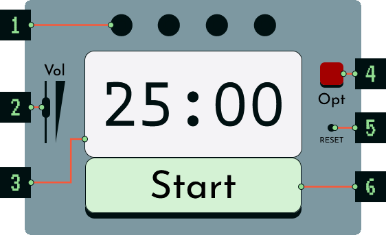
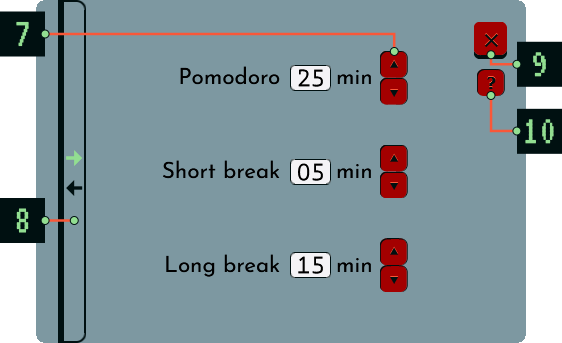
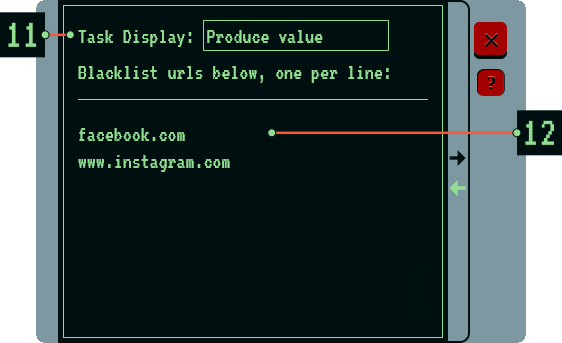
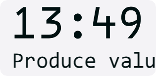

# Pomodoro Blacklist

This device will help your inattentive brain stay on task using the [Pomodoro Technique](https://en.wikipedia.org/wiki/Pomodoro_Technique). 

## Running
Currently awaiting review at [AMO](https://addons.mozilla.org), and future work may include porting it to Chrome. For now, you can run it temporarily in Firefox following [these instructions](https://extensionworkshop.com/documentation/develop/temporary-installation-in-firefox/).

## Front of device
 
<ol>
  <li>The device's counter, which tracks your pomodoros. During a pomodoro, a green light will pulse to indicate that you are very hard at work. During a break, a red light will pulse. Each green/red pair is a round. The Long Break occurs in the fourth round; the counter resets thereafter.  
    </li>
  <li>Controls the volume of all sound effects</li>
  <li>Displays countdown and, potentially, task (see 11)</li>
  <li>Flips the device over</li>
  <li>Resets the counter when held for three seconds</li>
  <li>Starts or stops the timer. If you stop, the current round will reset. This will help keep you from cheating and feeling shame.</li>
</ol>

## Back of device
### Timer Options
 
<ol start="7">
  <li>These buttons will increase/decrease timer periods. Hold buttons down if you are in a hurry.</li>
  <li>Opens the Blacklist monitor (see below)</li>
  <li>Flips the device over</li>
  <li>You probably clicked this to get here</li>
</ol>

### Blacklist Monitor
 
<ol start="11">
<li>Whatever you type in here will scroll across the display on the front of the device (see 3). There is no excuse for losing track of your purpose.   
  
</li>
<li>Allows you to block any sites that may cause you to stray from your true purpose</li>
</ol>

   
## License

This project is licensed under a dual license model:

1. **Creative Commons Attribution-NonCommercial 4.0 International (CC BY-NC 4.0)**: For non-commercial use. See [LICENSE.txt](LICENSE.txt) for details.
2. **Custom Commercial License**: For commercial use, which requires royalty payments. To negotiate terms, please contact Roberto Quesada at roberto.quesada@gmail.com.

For commercial license inquiries, please contact Roberto Quesada at roberto.quesada@gmail.com.